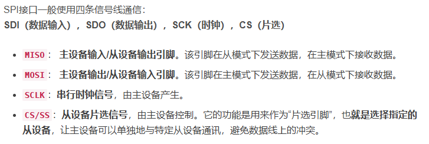
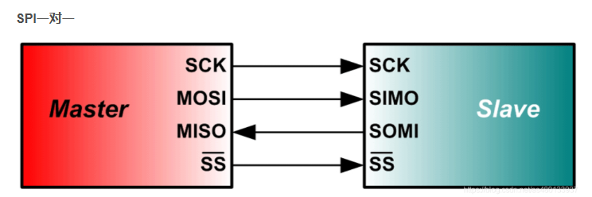
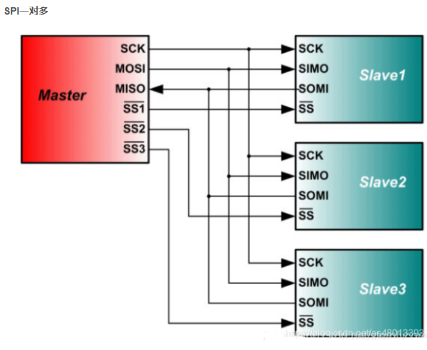

# 方案介绍
## esp-32 and lora spi通信 
### 
```text
 [L33-443 LoRa 模组]  ←SPI→  [e-Paper ESP32 DriverBoard]
                                  ↑
                               ESP32
```
## why?
```
当然是手上只有这些
```

### 引脚图


> **提示**
> spi Serial Peripheral interface
```
SPI信号线
SPI接口一般使用四条信号线通信：
SDI（数据输入），SDO（数据输出），SCK（时钟），CS（片选）

MISO： 主设备输入/从设备输出引脚。该引脚在从模式下发送数据，在主模式下接收数据。
MOSI： 主设备输出/从设备输入引脚。该引脚在主模式下发送数据，在从模式下接收数据。
SCLK：串行时钟信号，由主设备产生。
CS/SS：从设备片选信号，由主设备控制。它的功能是用来作为“片选引脚”，也就是选择指定的从设备，让主设备可以单独地与特定从设备通讯，避免数据线上的冲突。
```




### 

[spi介绍][https://blog.csdn.net/as480133937/article/details/105764119]
