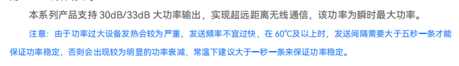

# 方案介绍

## esp-32 and lora（Long Range Radio） UART0通信

```text
 [L33-443 LoRa 模组]  ←UART0→  [e-Paper ESP32 DriverBoard]
                                  ↑
                               ESP32
```
## why?

```
当然是手上只有这些
```

### 服务器


==试试这个作为服务器还是本地待定。这个其实接触也不多==

### 引脚图



> 

> **lora注意事项**
> 不过我们好像是L33 433UD22s 可以看看
> 


